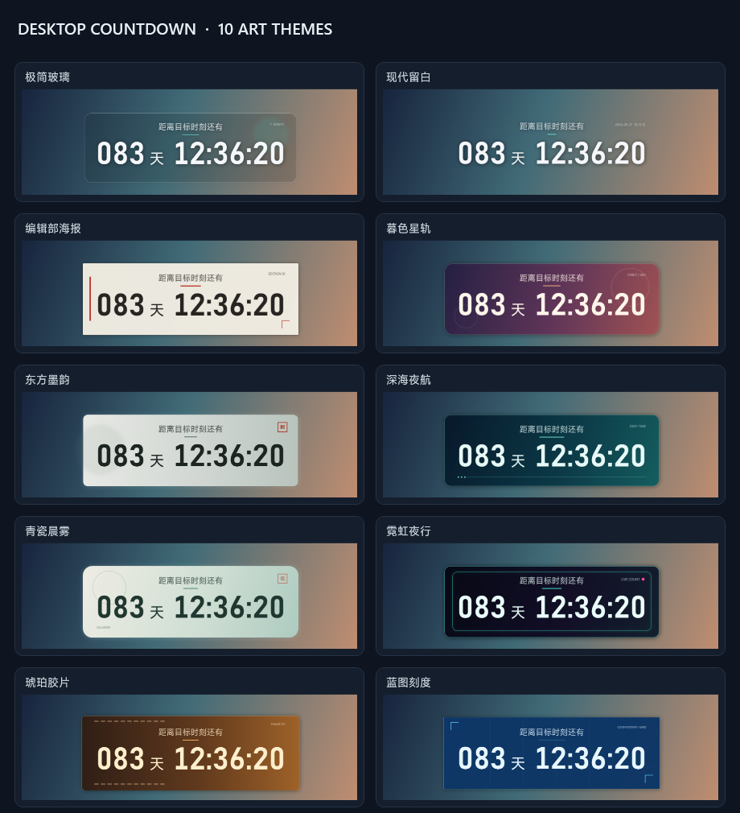

# Desktop Countdown 桌面倒计时

一款简洁、准确、可根据壁纸自动配色的 Windows 桌面倒计时。默认采用 MiSans 中文标题和 Bahnschrift SemiBold 等宽数字。




## 功能

- 按目标绝对时间重新计算，休眠或界面卡顿不会产生累计减秒误差。
- 精确显示到秒，通过 NTP 自动校准；网络不可用时安全回退到系统时间。
- 分析倒计时所在壁纸区域，自动选择深色或浅色文字。
- 十套内置风格：极简玻璃、现代留白、编辑部海报、暮色星轨、东方墨韵、深海夜航、青瓷晨雾、霓虹夜行、琥珀胶片、蓝图刻度。
- 每套主题拥有独立装饰构图，包括侧边标记、轨道圆环、印章、霓虹框、胶片孔和蓝图刻度等。
- 正式多尺寸应用图标已嵌入 EXE、设置窗口和系统托盘。
- 默认字体为 MiSans Regular 和 Bahnschrift SemiBold，支持选择其他系统字体和字号。
- 倒计时主体和“现代留白”主题右上角时间均支持预设及自定义格式，并有即时预览。
- 可选防烧屏微位移：六种路线、可调间隔与幅度、轻柔过渡及视觉呼吸。
- 设置页的“让桌面卡片试运行一次”可立即检验实际位移；打开设置页期间自动位移暂停，保存并关闭后重新计时，倒计时提示中显示下次预计位移时间。
- 设置页采用 Windows 11 风格的侧栏、分组卡片、圆角控件与 Fluent 图标；文字、开关和滚动条随系统切换浅色或深色。
- 设置页使用 Windows 系统强调色，并在深色模式下自动调整其亮度；支持时启用系统 Mica 窗口背景效果。
- 支持拖动、位置记忆、屏幕边缘吸附、锁定和鼠标穿透。
- 支持托盘操作、快速换主题、置顶、显示/隐藏及普通启动或登录任务启动。
- 始终使用普通透明窗口；此前实验性的桌面层挂接功能已移除。
- 无账户、无遥测；除用户配置的 NTP 校时外，不主动联网。

## 下载

从 [Releases](https://github.com/walker42144/desktop-countdown/releases/latest) 下载：

- `DesktopCountdown.exe`：直接运行版。
- `DesktopCountdown-v0.2.0-portable.zip`：包含程序和中文使用说明的便携包。

v0.3.1 已在本地构建，尚未发布到 GitHub。

当前发布文件未进行商业代码签名，因此 Windows 首次运行时可能显示未知发布者提示。

## 使用

1. 运行 `DesktopCountdown.exe`。
2. 首次启动时输入目标时间，格式为 `yyyy-MM-dd HH:mm:ss`。
3. 未锁定时可按住鼠标左键拖动。
4. 拖到屏幕工作区边缘附近时，可见卡片会自动贴边。
5. 双击倒计时或使用托盘图标打开设置。
6. 启用“锁定并穿透”后，请通过托盘菜单解除锁定。

配置文件保存在 `%LOCALAPPDATA%\DesktopCountdown\settings.json`。

## 构建

当前版本以 Windows 自带的 .NET Framework 4.8 WPF 为目标，不要求安装完整 Visual Studio。在 PowerShell 中运行：

```powershell
.\build.ps1
```

生成文件位于 `artifacts\DesktopCountdown.exe`。构建脚本还会运行冒烟测试，并使用真实 WPF 渲染器输出十套主题预览。需要隔离输出时可传入 `-OutputDirectory`。

运行生成的 EXE 后，双击倒计时或点击托盘菜单中的“设置”打开设置页。在“艺术风格”切换倒计时主题；设置页的浅色/深色外观跟随 Windows 的“应用模式”，重新打开设置页即可同步。使用 `--render-settings` 可在 EXE 同目录生成两种设置页的测试渲染图。

## 项目结构

```text
src/DesktopCountdown/
├─ AccurateClock.cs          NTP 校准与准确时间
├─ WallpaperColorService.cs 壁纸区域采样与配色
├─ ThemeCatalog.cs          艺术主题
├─ DisplayFormats.cs        倒计时与日期时间格式
├─ MotionPlanner.cs         防烧屏位移路径
├─ StartupService.cs        登录启动方式
├─ ClickThroughService.cs   锁定后的鼠标穿透
├─ EdgeSnapCalculator.cs    可见边缘吸附
├─ FluentTheme.cs           设置页主题色板与系统强调色
├─ MainWindow.cs            倒计时主窗口
└─ SettingsWindow.cs        设置和实时预览
```

`assets/ComboBoxTemplate.xaml`、`CheckBoxStyle.xaml` 和 `ScrollBarStyle.xaml` 分别定义下拉框、开关及滚动条样式；设置页的主题令牌集中在 `FluentTheme.cs`。Mica 与下拉弹窗的 Desktop Acrylic 使用 Windows 11 提供的 DWM 接口，旧系统自动退回纯色界面，不增加额外运行时依赖。

## 设计参考

产品交互参考了 Rainmeter、ElevenClock 和 DesktopClock 的成熟设计思路。项目没有复制它们的源代码、图标或视觉资产，相关记录见 [`docs/DESIGN_REFERENCES.md`](docs/DESIGN_REFERENCES.md)。

## 许可证

[MIT](LICENSE)
