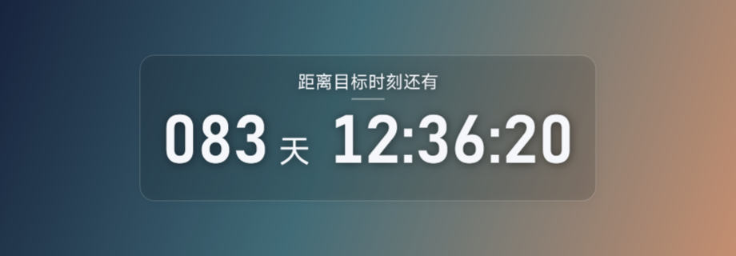

# Desktop Countdown 桌面倒计时

一款简洁、准确、可根据壁纸自动配色的 Windows 桌面倒计时。默认采用 MiSans 中文标题和 Bahnschrift SemiBold 等宽数字。



## 功能

- 按目标绝对时间重新计算，休眠或界面卡顿不会产生累计减秒误差。
- 精确显示到秒，通过 NTP 自动校准；网络不可用时安全回退到系统时间。
- 分析倒计时所在壁纸区域，自动选择深色或浅色文字。
- 五套内置风格：极简玻璃、现代留白、编辑部海报、暮色渐变、东方墨韵。
- 默认字体为 MiSans Regular 和 Bahnschrift SemiBold，支持选择其他系统字体和字号。
- 支持拖动、位置记忆、屏幕边缘吸附、锁定和鼠标穿透。
- 支持托盘操作、快速换主题、置顶、显示/隐藏及可选开机启动。
- 支持普通透明窗口和实验性 Windows 桌面层模式。
- 无账户、无遥测；除用户配置的 NTP 校时外，不主动联网。

## 下载

从 [Releases](https://github.com/walker42144/desktop-countdown/releases/latest) 下载：

- `DesktopCountdown.exe`：直接运行版。
- `DesktopCountdown-v0.1.1-portable.zip`：包含程序和中文使用说明的便携包。

当前发布文件未进行商业代码签名，因此 Windows 首次运行时可能显示未知发布者提示。

## 使用

1. 运行 `DesktopCountdown.exe`。
2. 首次启动时输入目标时间，格式为 `yyyy-MM-dd HH:mm:ss`。
3. 未锁定时可按住鼠标左键拖动。
4. 拖到屏幕工作区边缘附近时，可见卡片会自动贴边。
5. 双击倒计时或使用托盘图标打开设置。
6. 启用“锁定并穿透”后，请通过托盘菜单解除锁定。

配置文件保存在 `%LOCALAPPDATA%\DesktopCountdown\settings.json`。

## 构建

当前版本以 Windows 自带的 .NET Framework 4.8 WPF 为目标，不要求安装完整 Visual Studio。在 PowerShell 中运行：

```powershell
.\build.ps1
```

生成文件位于 `artifacts\DesktopCountdown.exe`。构建脚本还会运行冒烟测试，并使用真实 WPF 渲染器输出五套主题预览。

## 项目结构

```text
src/DesktopCountdown/
├─ AccurateClock.cs          NTP 校准与准确时间
├─ WallpaperColorService.cs 壁纸区域采样与配色
├─ ThemeCatalog.cs          艺术主题
├─ DesktopHostService.cs    桌面层和鼠标穿透
├─ EdgeSnapCalculator.cs    可见边缘吸附
├─ MainWindow.cs            倒计时主窗口
└─ SettingsWindow.cs        设置和实时预览
```

## 设计参考

产品交互参考了 Rainmeter、ElevenClock 和 DesktopClock 的成熟设计思路。项目没有复制它们的源代码、图标或视觉资产，相关记录见 [`docs/DESIGN_REFERENCES.md`](docs/DESIGN_REFERENCES.md)。

## 许可证

[MIT](LICENSE)
