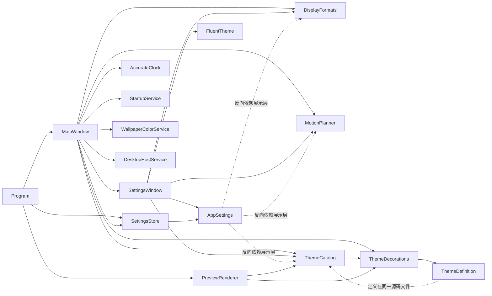

# 桌面倒计时代码审计

审计日期：2026-09-27。范围为当时的 `D:\timer` 工作区，**包含尚未提交的 0.3 功能改动**；这不是某个 Git 提交的审计结论。以下均为静态阅读结果，运行时影响标为风险而非已复现故障。本文只记录问题与方向，不授权直接重构。

## 1. 项目概览

- 目标：在 Windows 桌面显示可定制的倒计时，支持网络校时、壁纸取色、主题、位置/副屏、登录启动和防烧屏微位移。
- 技术栈：C#、WPF、.NET Framework 4.8；旧式 `DesktopCountdown.csproj`，无 NuGet/npm 包管理器。`build.ps1` 使用系统 `csc.exe`，开发入口为 PowerShell 7 的 `dev.ps1`；测试使用本机 Pester 3.4 兼容版本及应用内置冒烟检查。
- 入口：`src/DesktopCountdown/Program.cs:26` 的 `Main`；普通路径加载配置、创建 `MainWindow`。测试/预览参数也由该入口分流（`Program.cs:28-45`）。
- 主流程：`SettingsStore.Load` → `AppSettings.Validate` → `MainWindow` 创建计时器、主题及托盘 → `AccurateClock` 提供时间 → `UpdateCountdown` 与 `UpdateAppearance` 更新界面 → 设置窗口返回配置 → `StartupService.Apply` 和 `SettingsStore.Save`（`MainWindow.cs:726-735`）。
- 质量命令：`pwsh -File .\dev.ps1 lint|typecheck|test|build|check`；`check` 顺序执行四项（`dev.ps1:81-91`）。基线记录见 `docs/baseline.md`。常规测试不注册真实计划任务；`tools/Test-StartupTask.ps1` 属手动集成验证。

## 2. 目录树

以下是源文件/文档结构；忽略 `.git`、`node_modules`、`dist`、`build` 和生成的 `artifacts`。

```text
D:\timer
├─ AGENTS.md / README.md / PORTABLE_README.txt / CHANGELOG.md / LICENSE
├─ .editorconfig / .gitignore / DesktopCountdown.csproj
├─ build.ps1 / dev.ps1
├─ assets/
│  ├─ DesktopCountdown.ico / logo.svg / logo-256.png
│  └─ CheckBoxStyle.xaml / ComboBoxTemplate.xaml / ScrollBarStyle.xaml
├─ docs/
│  ├─ baseline.md / refactor-plan.md / DESIGN_REFERENCES.md
│  └─ images/ (预览和主题图片)
├─ src/DesktopCountdown/
│  ├─ Program.cs / MainWindow.cs / SettingsWindow.cs / app.manifest
│  ├─ AppSettings.cs / SettingsStore.cs / StartupService.cs / AccurateClock.cs
│  ├─ DisplayFormats.cs / MotionPlanner.cs / EdgeSnapCalculator.cs
│  ├─ DesktopHostService.cs / WallpaperColorService.cs
│  ├─ ThemeCatalog.cs / ThemeDecorations.cs / PreviewRenderer.cs
│  └─ FluentTheme.cs / IconFactory.cs
├─ tests/Baseline.Tests.ps1
└─ tools/Generate-BrandAssets.ps1 / Test-StartupTask.ps1
```

## 3. 模块清单及公开入口

| 模块/文件 | 职责 | 公开入口或边界 |
| --- | --- | --- |
| `Program.cs` | 进程启动、命令行自检、异常入口 | `Program.Main`（26） |
| `MainWindow.cs` | 桌面倒计时 UI、托盘、调度和设置协调 | `MainWindow(AppSettings)`（64） |
| `SettingsWindow.cs` | 设置 UI、校验与预览 | `SettingsWindow(...)`（87）、`Result`（85）、`OpenOnScreen`（364）、`MotionTrialRequested`（36） |
| `AppSettings.cs` | 配置数据、默认值、校验、目标时间解析 | `CreateDefault`（38）、`Validate`（73）、`GetTargetLocal`（97）、`Clone`（110）及公开数据成员（10-36） |
| `SettingsStore.cs` | JSON 文件读写及旧注册表启动项入口 | `SettingsDirectory/Path`（13/21）、`Load`（26）、`Save`（46）、`ApplyStartupSetting`（78） |
| `StartupService.cs` | 注册表/计划任务登录启动 | `Apply`（17） |
| `AccurateClock.cs` | 系统时间与 NTP 偏差 | 构造函数（23）、时间/状态属性（28-54）、`Start`（56）、`ChangeServer`（61）、`SyncAsync`（71） |
| `DisplayFormats.cs` | 倒计时及右上角时钟格式 | `Countdown`（15）、两个 `TryValidate`（43/79）、`ClockNeedsSeconds`（99）、默认常量（10-11） |
| `MotionPlanner.cs` | 六种位移路径及可见区域限制 | 模式数组（29-30）、`Next`（32）、`Constrain`（68）、`EnsureVisibleMove`（79） |
| `EdgeSnapCalculator.cs` | 屏幕边缘吸附计算 | `SnapAxis`（7） |
| `DesktopHostService.cs` | Explorer 桌面层挂接和鼠标穿透 | `ApplyDesktopMode`（27）、`ApplyClickThrough`（62）、`IsAttached`（25） |
| `WallpaperColorService.cs` | 壁纸定位、采样和建议前景色 | `Analyze`（26）；结果类型 `WallpaperAppearance`（10） |
| `ThemeCatalog.cs` | 主题定义、清单、选择及预览应用 | `ThemeDefinition`（9）、`All`（39）、`Get`（91）、`ApplyPreview`（98） |
| `ThemeDecorations.cs` | 主题装饰绘制 | `Apply`（11） |
| `PreviewRenderer.cs` | 主题图片/图集渲染 | `RenderAll`（15） |
| `FluentTheme.cs` | 设置窗口色彩和资源字典 | 内部类 `FluentTheme`（7）、`Install`（49），无程序集外公开入口 |
| `IconFactory.cs` | 托盘与窗口图标 | `CreateClockIcon`（13）、`CreateWindowIcon`（29） |
| `build.ps1` / `dev.ps1` | 编译产物和统一质量命令 | 脚本参数（`build.ps1:2-6`、`dev.ps1:2-6`） |
| `tests/` / `tools/` | Pester 基线、资源生成、启动任务手动验证 | `tests/Baseline.Tests.ps1:3`；两个工具脚本的参数入口 |

## 4. 模块依赖

箭头表示“调用或引用”。图仅展示主要源码依赖，不是全量类型调用图。



`ThemeCatalog.cs:9` 定义 `ThemeDefinition`，而 `ThemeCatalog.cs:117` 调用 `ThemeDecorations.Apply`；后者在 `ThemeDecorations.cs:11` 接受 `ThemeDefinition`，形成**源码文件级循环**，并非运行时递归。`AppSettings.cs:60-64` 引用展示/位移模块，属于从配置数据层指向展示层的反向依赖。

## 5. 问题清单

优先级是审计建议；“影响”说明潜在后果，不表示已在用户机器上复现。所有路径相对仓库根目录。

### P0

未发现有足够证据直接定为 P0 的问题；系统启动项和配置恢复风险列为 P1，需通过隔离测试再判断严重度。

### P1

| 编号 | 问题与证据 | 影响 | 修复方向 |
| --- | --- | --- | --- |
| P1-01 | 启动项先改系统状态后存配置（`src/DesktopCountdown/MainWindow.cs:732-735`）；任务/注册表切换也分步执行（`src/DesktopCountdown/StartupService.cs:17-28`）。 | 后一步失败时，UI/配置与实际启动状态可能不一致；具体失败路径需人工确认。 | 先以假后端覆盖每一步失败，再读取实际状态并设计补偿，不改变公开 `Apply` 签名。 |
| P1-02 | 配置文件损坏或读取失败一律返回默认值（`src/DesktopCountdown/SettingsStore.cs:26-43`）。 | 原设置可能被误判为首次运行，问题原因不可见。 | 区分不存在、损坏、IO 错误；保留坏文件并明确提示恢复路径。 |
| P1-03 | `File.Replace` 失败后直接用 `File.Copy(..., true)` 覆盖原件（`src/DesktopCountdown/SettingsStore.cs:60-70`）。 | 备份/替换语义失效时可能失去唯一可恢复的配置；需注入失败验证。 | 用临时目录和故障注入测试，确保失败前后原件/备份字节可恢复。 |
| P1-04 | 无效目标时间最终退化为 `DateTime.Now`（`src/DesktopCountdown/AppSettings.cs:97-107`），主窗口继续计算（`src/DesktopCountdown/MainWindow.cs:315-317`）。 | 非法设置看起来像到点而非输入错误。 | 在加载/校验边界显式表达无效目标；保持正常格式兼容。 |
| P1-05 | NTP 包只验证长度，未校验响应模式、层级、传输时间戳等（`src/DesktopCountdown/AccurateClock.cs:123-133`）；时间基准直接取 `DateTime.UtcNow + offset`（同文件 `28-33`）。 | 异常响应或系统时钟跳变可能使倒计时偏移；实际触发条件需人工确认。 | 加可控时间源/本地假响应测试，再校验响应并限制异常偏差。 |
| P1-06 | 现有 Pester 主要覆盖冒烟和渲染（`tests/Baseline.Tests.ps1:3-16`）；关键持久化、校时、启动失败路径没有确定性回归用例，部分断言埋在应用自检（`src/DesktopCountdown/Program.cs:86-175`）。 | 核心重构缺少安全网；真实系统状态与时钟边界不易复现。 | 先固定测试发现，再逐模块添加隔离、可重复的边界测试。 |

### P2

| 编号 | 问题与证据 | 影响 | 修复方向 |
| --- | --- | --- | --- |
| P2-01 | `AppSettings` 的默认值/校验直接引用 `ThemeCatalog`、`DisplayFormats`、`MotionPlanner`（`src/DesktopCountdown/AppSettings.cs:60-64`、`84-90`）。 | 配置模型随展示实现变化，分层边界弱。 | 提取内部默认值契约；保持现有公开常量和 JSON 字段。 |
| P2-02 | 主题目录调用装饰绘制（`src/DesktopCountdown/ThemeCatalog.cs:117`），装饰绘制依赖目录文件中定义的类型（`src/DesktopCountdown/ThemeDecorations.cs:11`、`ThemeCatalog.cs:9`）。 | 文件级循环使主题修改易互相牵连。 | 单独放置 `ThemeDefinition`，两者单向依赖定义。 |
| P2-03 | 位移状态散落于主窗口多个字段及定时器（`src/DesktopCountdown/MainWindow.cs:28-43`、`445-556`）。 | 预览、贴边、动画和正常位移的状态容易相互覆盖。 | 提取会话状态对象，先锁定六种模式与复位行为。 |
| P2-04 | 多处空 `catch` 或仅回退且无诊断（`src/DesktopCountdown/MainWindow.cs:489`、`519`、`556`；`src/DesktopCountdown/SettingsWindow.cs:442`）。 | 故障原因难定位，可能被误判为功能未生效。 | 统一有限量的本地诊断出口，保留既有回退决策。 |
| P2-05 | 未处理异常完整追加到无上限 `error.log`（`src/DesktopCountdown/Program.cs:75-79`），并把异常消息直接显示给用户（`Program.cs:81-82`）。 | 日志可能持续增长并包含本地路径等敏感文本；具体内容取决于异常。 | 限制大小、脱敏路径，测试日志写入失败。 |
| P2-06 | 默认倒计时在主窗口手写（`src/DesktopCountdown/MainWindow.cs:331-339`），自定义格式走 `DisplayFormats.Countdown`（`MainWindow.cs:321-324`）。 | 两条显示路径的补零/符号规则可能漂移。 | 在格式回归测试后统一计算入口，逐字符保持默认显示。 |
| P2-07 | `SettingsWindow` 构造函数横跨 UI 资源、导航、表单与预览（`src/DesktopCountdown/SettingsWindow.cs:87-362`）；`MainWindow` 同时管计时、主题、托盘、位移和保存（`src/DesktopCountdown/MainWindow.cs:64-854`）。 | 长函数/高耦合增加局部改动的回归范围。 | 分阶段拆位移会话与设置分组；不一次性搬移全部 UI。 |
| P2-08 | `SettingsStore.ApplyStartupSetting` 仍作为公开注册表入口存在（`src/DesktopCountdown/SettingsStore.cs:78-88`），主保存路径改用 `StartupService.Apply`（`src/DesktopCountdown/MainWindow.cs:732-735`）。 | 重复职责和潜在旧调用；是否存在外部调用需人工确认。 | 先查调用和兼容承诺；公共 API 不明时不直接删除。 |
| P2-09 | 每次壁纸分析都新建完整 `Bitmap`（`src/DesktopCountdown/WallpaperColorService.cs:26-42`），主窗口外观更新可再次调用分析（`src/DesktopCountdown/MainWindow.cs:375-421`）。 | 高频窗口变化可能产生同步解码和 UI 卡顿；需测量确认。 | 固定图像基准后加入有界缓存或后台采样。 |
| P2-10 | `MotionPlanner.Modes/Names` 是可改写的公开数组（`src/DesktopCountdown/MotionPlanner.cs:29-30`）；配置默认值依赖其成员（`src/DesktopCountdown/AppSettings.cs:64`）。 | 全局可变状态和索引配对可能被调用者破坏。 | 内部使用只读快照；公开数组兼容策略需人工确认。 |
| P2-11 | 启动 XML 用例受源文件存在性条件控制（`tests/Baseline.Tests.ps1:18-45`）。 | 同一 `test` 命令在不同工作树可少跑一项但仍通过。 | 固定测试发现、用例标识与精确数量；缺失目标明确失败。 |
| P2-12 | `build.ps1` 枚举目录内所有 `.cs`（`build.ps1:32`），而 `.csproj` 明列编译文件（`DesktopCountdown.csproj:49-65`）。 | 新文件可能只进入一种构建路径。 | 选定单一源码清单并测试缺失/重复。 |
| P2-13 | 刷新周期通过字符串包含 `"{seconds"` 判断（`src/DesktopCountdown/MainWindow.cs:344-355`），与格式器的占位符正则（`src/DesktopCountdown/DisplayFormats.cs:13-15`）不是同一解析入口。 | 特殊格式文本下刷新频率可能与实际显示不一致；需边界测试。 | 让格式解析结果同时决定显示和刷新周期。 |
| P2-14 | 桌面层挂接连续调用 `GetWindowRect`、`SetWindowLong`、`SetParent` 等，未逐步检查结果或回滚（`src/DesktopCountdown/DesktopHostService.cs:38-46`）。 | Explorer/窗口状态异常时可能留下半挂接状态；需模拟失败确认。 | 记录原状态，逐步检查 Win32 结果，失败逆序恢复。 |
| P2-15 | 没有验证两套构建源码清单一致的测试；`dev.ps1 test` 固定只运行一个文件（`dev.ps1:64`），而项目清单独立维护（`DesktopCountdown.csproj:49-65`）。 | 即使新增清单测试文件，也可能不会被发现；构建遗漏风险持续。 | 在 R01 固定测试发现后，于 R02 加清单一致性负向用例。 |

覆盖映射：分层边界 P2-01/02，业务逻辑散落 P2-03/07，全局状态 P2-10，错误处理 P1-02/03 与 P2-04，日志/配置/密钥 P2-05 与 P1-02（未见硬编码密钥；仅审到 `AppSettings.cs:26` 的 NTP 服务器默认值），类型严格性 P2-10 与 P1-04，重复代码 P2-06/08，长函数 P2-07，死代码候选 P2-08，测试缺口 P1-06/P2-11/15，命名一致性见 `AppSettings.cs:26-36` 的 JSON 数据字段与 `SettingsWindow.cs:37-63` 控件字段（当前未发现可独立定级的命名故障；需人工确认风格目标），性能隐患 P2-09。

## 6. 最不敢直接改的文件

| 文件 | 原因 |
| --- | --- |
| `src/DesktopCountdown/MainWindow.cs` | 计时、窗口、托盘、系统设置、位移与保存汇聚，任何改动都可能改变桌面实际行为。 |
| `src/DesktopCountdown/SettingsWindow.cs` | 1000 行级代码构造 UI 并绑定大量事件；暗色/副屏/预览需视觉验证。 |
| `src/DesktopCountdown/AppSettings.cs` | 公开 JSON 字段与旧用户配置兼容相关。 |
| `src/DesktopCountdown/SettingsStore.cs` | 直接触及用户配置原件和备份。 |
| `src/DesktopCountdown/StartupService.cs` | 修改注册表和真实计划任务，必须隔离账户验证。 |
| `src/DesktopCountdown/AccurateClock.cs` | 网络与系统时间共同决定倒计时结果。 |
| `src/DesktopCountdown/DesktopHostService.cs` | Win32 父子窗口和样式改动可能使窗口不可见或不可操作。 |
| `src/DesktopCountdown/ThemeCatalog.cs` | 主题键写入配置，修改键会影响旧配置；与装饰绘制耦合。 |
| `build.ps1` | 负责所有编译输入与产物，误改会令两套构建入口分叉。 |

## 7. 建议的重构阶段方向

以 `docs/refactor-plan.md` 为可执行计划：先 R01 固定测试发现、R02 固定构建清单，再处理配置边界与恢复（R03-R04）、启动和时间核心（R05-R07）、格式与诊断（R08-R09），最后处理主题、位移、壁纸、桌面层和设置布局（R10-R14）。每阶段只处理一个主题，先写边界测试，保留公开 API，单独提交/回滚。

## 新发现

| 编号 | 问题与证据 | 影响 | 修复方向 |
| --- | --- | --- | --- |
| N-01 | R01 后 `dev.ps1:62-68` 固定核对测试文件名，`dev.ps1:70-91` 固定核对用例名和数量；但 R03 原范围（`docs/refactor-plan.md:43-45`）要求新增 `tests/SettingsDefaults.Tests.ps1`，未允许同步修改 `dev.ps1`。 | 按原 R03 范围新增测试会使 `check` 在用例执行前失败；不新增测试又无法完成阶段验收。 | 在 R03 范围内加入 `dev.ps1`，只登记新测试文件和用例标识；不放宽 R01 的固定数量门禁。 |
| N-02 | R04 原范围（`docs/refactor-plan.md:55-57`）要求新增 `tests/SettingsStore.Tests.ps1`，但 `dev.ps1:62-68` 固定核对测试文件名，`dev.ps1:70-91` 固定核对用例名和数量，原范围未包含 `dev.ps1`。 | 新测试无法通过既有测试清单门禁，R04 不能按原范围独立验收。 | 将 `dev.ps1` 纳入 R04 范围，仅登记新测试文件和用例标识，保留固定数量门禁。 |
| N-03 | R04 新测试曾使用 `Should Throw`（`tests/SettingsStore.Tests.ps1:60`）；本机 PowerShell 7 + Pester 3.4 将最小用例 `{ throw 'x' } \| Should Throw` 误判为未抛异常。 | 异常路径测试出现假失败，并使测试发现负向用例的失败数失真；属于本机验证环境兼容性，其他环境需人工确认。 | R04 测试改用显式 `try/catch` 捕获异常并断言结果，保留实际异常路径及文件字节断言；不放宽测试发现门禁。 |
| N-04 | R05 原范围（`docs/refactor-plan.md:67-69`）要求新增 `tests/StartupService.Tests.ps1`，但 `dev.ps1:62-68` 固定核对测试文件名，`dev.ps1:70-102` 固定核对用例名和数量，原范围未包含 `dev.ps1`。 | 按原范围新增测试无法通过既有门禁，阶段不能独立验收。 | 将 `dev.ps1` 纳入 R05 范围，仅登记新测试文件和用例标识，不放宽固定数量门禁。 |

后续新发现仍需给出 `文件:行号`；记录问题本身不授权扩大阶段代码修改范围。
